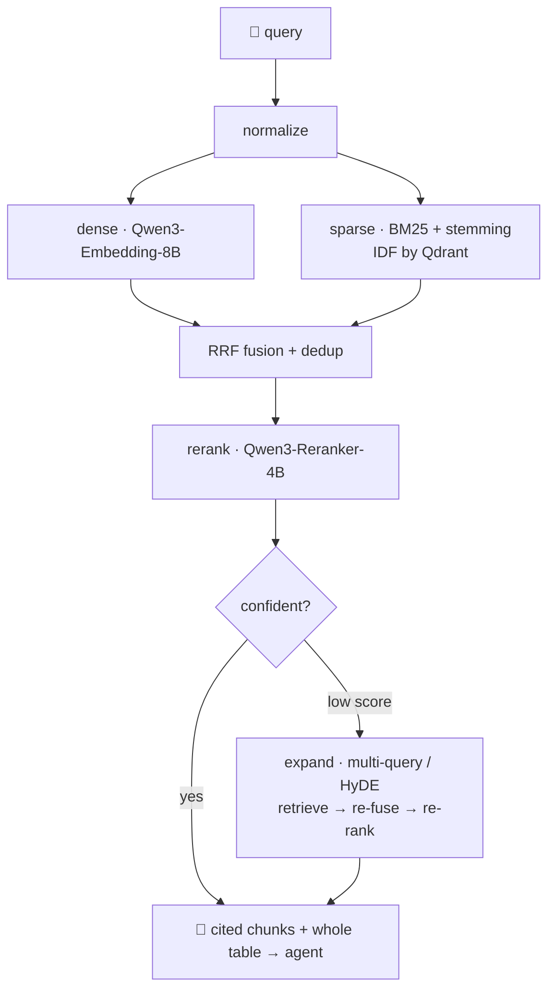

<div align="center">

# 🧠 Domain Knowledge MCP

### Retrieval that actually finds the number in the table.

A production-grade, domain-isolated **knowledge server for LLM agents** — hybrid search,
table-aware retrieval, and a reranked, cited answer surface, exposed as a single MCP tool.

`hybrid search` · `table-intelligent` · `Russian-first` · `MCP-native` · `eval-gated`

</div>

---

## The problem it solves

Ask a real business document a real question:

> **«Назови стоимость эксплуатации при 45 процедурах у заказчика»**

The answer — `562 500 ₽` — lives in **one cell of one table**, on row *45*, under the column
*«Стоимость эксплуатации»*. Ordinary RAG shreds that table into a word-window, scatters the
number away from its column header, and the model shrugs — or invents a plausible-looking
figure.

**This stack returns `562 500 ₽`, cited, with the whole table for context.** That is the
entire point.

---

## Why it's different

| | |
|---|---|
| 📊 **Table-intelligent** | Every table row becomes a self-contained fact that binds each value to its column and caption. A table is never split mid-row, and on a hit the **whole table** is returned so the model reads the answer cell in context. |
| 🔀 **True hybrid retrieval** | Dense semantic search (Qwen3-Embedding-8B) **and** BM25 lexical search fuse with Reciprocal Rank Fusion, then a Qwen3 cross-encoder reranks the survivors. Dense blurs; lexical nails identifiers, numbers, and exact terminology. |
| 🇷🇺 **Russian-first lexical** | Snowball stemming on both query and document — `стоимости` matches `стоимость`, `процедурах` matches `процедур` — so the exact-term branch actually fires on inflected queries. |
| 🎯 **Cost-aware expansion** | Multi-query / HyDE expansion runs **only** when the first pass is low-confidence. The common query pays nothing extra; hard queries get a second, smarter pass. Off by default, one flag to arm. |
| 🔒 **Isolated by construction** | One code base, deployed once **per domain** (`hr`, `finance`, `warehouse`…), each with its own Postgres, Qdrant collection, S3 bucket, queue namespace and tokens. A name not scoped to the domain refuses to boot. |
| 🛠️ **Full corpus lifecycle** | Verified ingestion → `READY`, idempotent re-delivery, immediate-exclude deletion, **atomic reindex cutover**, dead-letter inspect/redrive, and stale-lease recovery — all on a separate operational identity the LLM never sees. |
| 📈 **Eval-gated** | A golden retrieval eval (recall@k / MRR over a curated Q→A set) runs in CI. Change the chunker, the tokenizer, or the ranker and a regression fails the build — not production. |
| 🧪 **Zero-infra tests** | The entire test matrix — unit, property (Hypothesis), contract, integration, security — runs on in-memory fakes. No Docker required to prove correctness. |

---

## How retrieval works



The ingestion side is where the retrieval magic is planted: a document is parsed to canonical
Markdown, chunked **structure-aware** (tables stay whole), and every table row is additionally
linearized into a fact like:

```
Таблица 17. Процедур в год у заказчика: 45; Доказуемый эффект, руб.: 1 125 000;
Стоимость эксплуатации, руб.: 562 500; Выручка 2030, млн руб.: 103,1; Кратность возврата: 2,26.
```

Now the answer is a single retrievable unit — dense, sparse, and the reranker all agree, and
the model reads the value already bound to its column.

---

## Pluggable retrieval backends

Two lines of `.env` point the whole stack at an OpenAI/Cohere-shaped gateway:

```bash
RAG_MCP_EMBEDDING_API_URL=https://openrouter.ai/api/v1
RAG_MCP_EMBEDDING_API_TOKEN=sk-or-...
```

| Setting | Options | Meaning |
|---|---|---|
| `embedding_provider` | `openai` · `custom` | Dense + rerank over a hosted gateway, or over your own Embedding API |
| `sparse_provider` | `bm25` · `api` | Lexical weights computed in-process (no model server), or served by a sparse model |
| `enable_query_expansion` | `false` · `true` | Arm the selective multi-query / HyDE second pass |
| `search_return_full_table` | `true` · `false` | Return the whole table on a table hit |

With the defaults, the lexical branch needs **no service at all** — BM25 term weights are
computed locally and Qdrant supplies the IDF.

---

## Quick start — Docker Compose

```bash
# 1. Store token hashes (only the hash is ever persisted, never the token)
python -c "from app.session.auth import hash_token; print(hash_token('chat-dev'))"
python -c "from app.session.auth import hash_token; print(hash_token('ops-dev'))"
#    → RAG_MCP_CHAT_SERVICE_TOKEN_HASH / RAG_MCP_OPS_SERVICE_TOKEN_HASH in .env

# 2. Bring up Postgres, Qdrant, MinIO, RabbitMQ, embeddings, migrate, server, worker
docker compose --profile app up -d --build
```

- **Chat MCP** → `POST http://localhost:8080/mcp`, `Authorization: Bearer chat-dev` — exposes
  exactly one tool, `search_knowledge`. Readiness at `GET /health/ready`.
- **Operational API** → `http://localhost:8090`, `Authorization: Bearer ops-dev` — ingestion,
  documents, downloads, DLQ, `/metrics`. Never reachable from the chat surface.

Drop `--profile app` to run only the datastores and drive the server/worker from your console.

## Quick start — local

```bash
uv sync
cp .env.example .env               # fill the token hashes
uv run alembic upgrade head        # baseline schema
uv run rag-mcp provision           # seed index config v1 + Qdrant collection
uv run fake-embedding-api          # deterministic dev embeddings on :8000
uv run rag-mcp serve               # chat MCP :8080 + operational API :8090
uv run rag-mcp worker              # ingestion / deletion / reindex consumer

# ingest a document through the operational identity (the chat surface only searches)
uv run python scripts/ingest_local.py ./handbook.md
```

Compose publishes Postgres on host port **5433**, so an orchestrator with its own Postgres on
5432 runs side by side.

---

## Quality

```bash
uv run pytest -q                         # unit · property · contract · integration · security
uv run python scripts/run_eval.py        # golden retrieval eval → recall@k / MRR (CI gate)
uv run ruff check app scripts tests
```

The suite runs entirely on in-memory fakes. Real-infrastructure E2E and load/soak live behind
`RUN_INTEGRATION=1` (they need a Docker daemon). Operational procedures — deploy/rollback,
backup/restore, rotation, alerts — are in
[`docs/domain-mcp/RUNBOOK.md`](docs/domain-mcp/RUNBOOK.md).

---

## Architecture at a glance

One `app/` package; the **server** and the **worker** are two modes of the same binary
(`rag-mcp serve | worker | provision`). FastMCP transport, Dynaconf config validated by a
Pydantic model that enforces the domain-isolation guard and fail-fast startup.

```
app/
├── tools/search/       chat surface — the one MCP tool, a thin delegate
├── search/             hybrid retrieval: fusion · rerank · selective expansion
├── ingestion/          parse → structure-aware chunk → linearize tables → embed → index
├── deletion/ reindex/  lifecycle engines (atomic reindex cutover, idempotent deletion)
├── storage/            Qdrant · S3 · Postgres · RabbitMQ · BM25 · embedding gateways
├── operational/        internal control plane (FastAPI) — ingestion, DLQ, documents
├── session/            split chat / ops identities and scopes
└── testing/            deterministic fakes + fake Embedding API
```

<div align="center">

**Built for agents that need the right number, cited, every time.**

</div>
